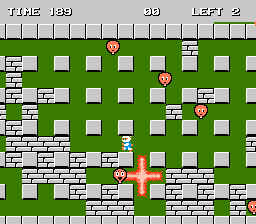
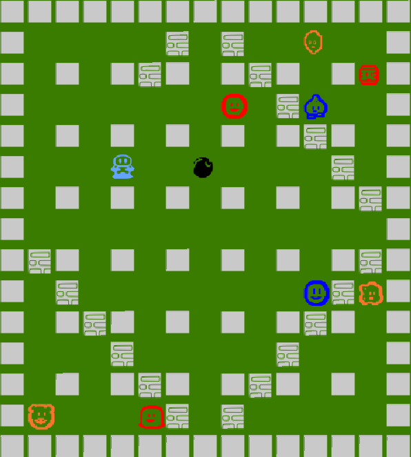

## LDTS_L08GR07 - Bomberman

In this remake of the NES classic, Bomberman, you will be able to help again the robot Bomberman find his way through a maze, while avoiding enemies that try to stop you.
The maze is composed of several levels that you can advance to the next one by finding the door and going through it. 

This project was developed by *Diogo Sarmento* (*up202109663*@fe.up.pt), *Manuel Neto* (*up202108744*@fe.up.pt) and *Tomás Vicente* (*up202108717*@fe.up.pt) for LDTS 2022⁄23.

### IMPLEMENTED FEATURES

- **Loading level from a file** - The level to be played is loaded from a file that contains the "map" of that level.
- **Place bombs** - Bomberman will place a bomb when the X key is pressed.
- **Explode rocks** - When the bomb's flame reaches a rock, it will dissapear and there is a chance of it dropping an upgrade.
- **Upgrading your character** - After collecting your upgrade, your character will be upgraded, either itself (higher speed, ability to pass through bombs or walls, ...) or the bombs it drops (higher flame area, one bomb's flame triggering another ones, ...).
- **Kill enemies** - When the bomb's flame reaches an enemy, it will kill it.
- **Die** - The player can lose the game if they lose all their lives, either by exploding themselves with a bomb or by getting caught by an enemy.

### PLANNED FEATURES

- **Detonator powerup** - Bomberman would be able to detonate his oldest bomb with a press of a button

In the future, the game should look like this mockup:

And it does!

### DESIGN

#### THE VIEWERS

**Problem in Context**

We wanted to implement a viewer for each component of the game (bomberman, enemies, obstacles, walls - and, in the future, bombs).
So, we had a class that couldn't anticipate the class of objects it must create, thus the class wanted the subclasses to specify the objects it creates.

**The Pattern**

We have applied the **Factory Method** pattern.
This pattern consists in defining and interface for creating an object, but letting subclasses decide which class to instantiate.
Because of that, this pattern was a good fit for the problem.

**Implementation**

The following UML class diagram shows how the pattern's roles were mapped to the application classes.

The interface and the classes can be found in the following files:

- [Interface ElementViewer](../src/main/java/pt/up/fe/bomberman/viewer/game/ElementViewer.java)
- [Class BombermanViewer](../src/main/java/pt/up/fe/bomberman/viewer/game/BombermanViewer.java)
- [Class EnemyViewer](../src/main/java/pt/up/fe/bomberman/viewer/game/EnemyViewer.java)
- [Class ObstacleViewer](../src/main/java/pt/up/fe/bomberman/viewer/game/ObstacleViewer.java)
- [Class WallViewer](../src/main/java/pt/up/fe/bomberman/viewer/game/WallViewer.java)

**Consequences**

The use of the Factory Method Pattern in the current design eliminates the need to bind application-specific classes into the code.
The code only need to deal with the ElementViewer interface; therefore it can work it with any of the concrete classes.

#### KNOWN CODE SMELLS AND REFACTORING SUGGESTIONS

#### Large Switch Statements

The Enemy and Powerup have an extensive enum and following switch statements related to it. This is problematic because it isn't just suboptimal, but also turns readability worse.

A way to improve the code would be to create seperate classes for each type of Enemy and Powerup. However, it would create another code smell (Lazy Class), as the code doesn't change much for each particular subclass. So we decided to leave it as it is, as a way to not harm the code's structure and readability.

#### **Large Class**

Some classes (e.g. Game, Battlefield, Player) contain many fields and others (e.g. GUI interface) contain many methods. In both cases, we find it justifiable as the classes require these fields, in one hand the Game class is the main class of the program and it needs to store a considerable amount of data, on the other hand various methods are needed for the interface and it wouldn't make sense to split it into two separate ones (extract method).

#### **Data Class**

When using the Model-View-Controller pattern, the model classes fall into the Data Classes smell, as they only contain data about the model and close to little methods. This doesn't need to be corrected, as it only happens because we chose to use this design pattern.

#### **Feature envy**

By using the Model-View-Controller pattern on our game, we end up falling in some code smells that we can't avoid, if we want to use this pattern. Therefore the Controller classes end up envying their respective model. 

#### **Message chains**

Additionally, the methods to get data from the models get chained one after another with methods that alter the model's behaviour, which get hard to read after a certain length. This could be avoided by extracting those chains to an auxilary method, however it would create a middleman method smell and the lazy method smell, as those chains aren't used as often.

### TESTING

- Screenshot of coverage report.

- [Link to mutation testing report](report/index.html)

### SELF-EVALUATION

- Diogo Sarmento: 35%
- Manuel Neto: 35%
- Tomás Vicente: 30%
