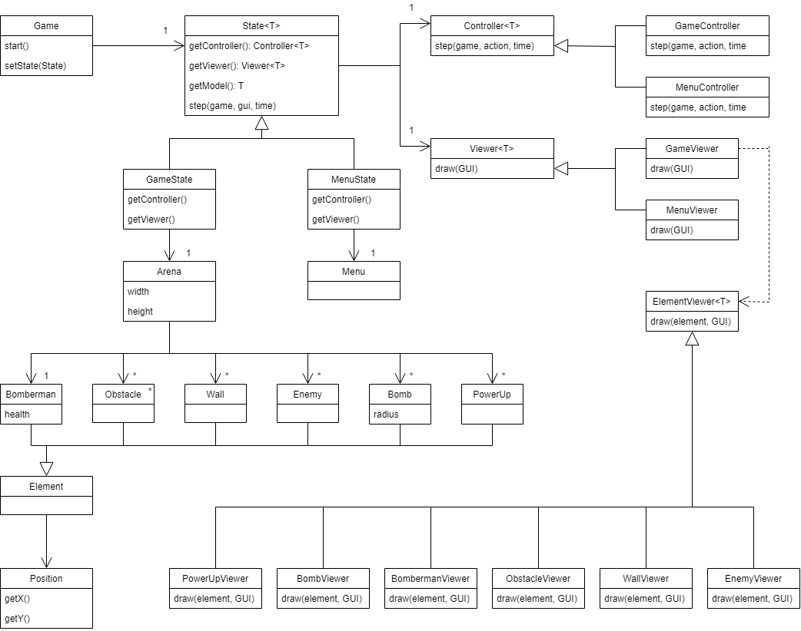

## LDTS_L08GR07 - Bomberman

In this remake of the NES classic, Bomberman, you will be able to help again the robot Bomberman find his way through a maze, while avoiding enemies that try to stop you.
The maze is composed of several levels that you can advance to the next one by finding the door and going through it. 

This project was developed by *Diogo Sarmento* (*up202109663*@fe.up.pt), *Manuel Neto* (*up202108744*@fe.up.pt) and *Tomás Vicente* (*up202108717*@fe.up.pt) for LDTS 2022⁄23.

### IMPLEMENTED FEATURES

- **Loading level from a file** - The level to be played is loaded from a file that contains the "map" of that level.

### PLANNED FEATURES

- **Place bombs** - Bomberman will place a bomb when the X key is pressed.
- **Explode rocks** - When the bomb's explosion reaches a rock, it will dissapear and there is a chance of it dropping an upgrade.
- **Upgrading your character** - After collecting your upgrade, your character will be upgraded, either itself (higher speed, ability to pass through bombs or walls, ...) or the bombs it drops (higher explosion area, one bomb's explosion triggering another ones, ...).
- **Kill enemies** - When the bomb's explosion reaches an enemy, it will kill it.
- **Die** - The player can lose the game if they die, either if they explode themselves with a bomb or an enemy gets to them.

### DESIGN

#### THE VIEWERS

**Problem in Context**

We wanted to implement a viewer for each component of the game (bomberman, enemies, obstacles, walls - and, in the future, bombs).
So, we had a class that couldn't anticipate the class of objects it must create, thus the class wanted the subclasses to specify the objects it creates.

**The Pattern**

We have applied the **Factory Method** pattern.
This pattern consists in defining and interface for creating an object, but letting subclasses decide which class to instantiate.
Because of that, this pattern was a good fit for the problem.

**Implementation**

The following UML class diagram shows how the pattern's roles were mapped to the application classes.

The interface and the classes can be found in the following files:

- [Interface ElementViewer](../src/main/java/pt/up/fe/bomberman/viewer/game/ElementViewer.java)
- [Class BombermanViewer](../src/main/java/pt/up/fe/bomberman/viewer/game/BombermanViewer.java)
- [Class EnemyViewer](../src/main/java/pt/up/fe/bomberman/viewer/game/EnemyViewer.java)
- [Class ObstacleViewer](../src/main/java/pt/up/fe/bomberman/viewer/game/ObstacleViewer.java)
- [Class WallViewer](../src/main/java/pt/up/fe/bomberman/viewer/game/WallViewer.java)

**Consequences**

The use of the Factory Method Pattern in the current design eliminates the need to bind application-specific classes into the code.
The code only need to deal with the ElementViewer interface; therefore it can work it with any of the concrete classes.

### TESTING

- Screenshot of coverage report.

- Link to mutation testing report.

### SELF-EVALUATION

- Diogo Sarmento: 33%
- Manuel Neto: 33%
- Tomás Vicente: 33%
